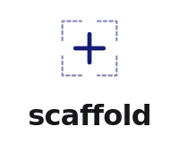
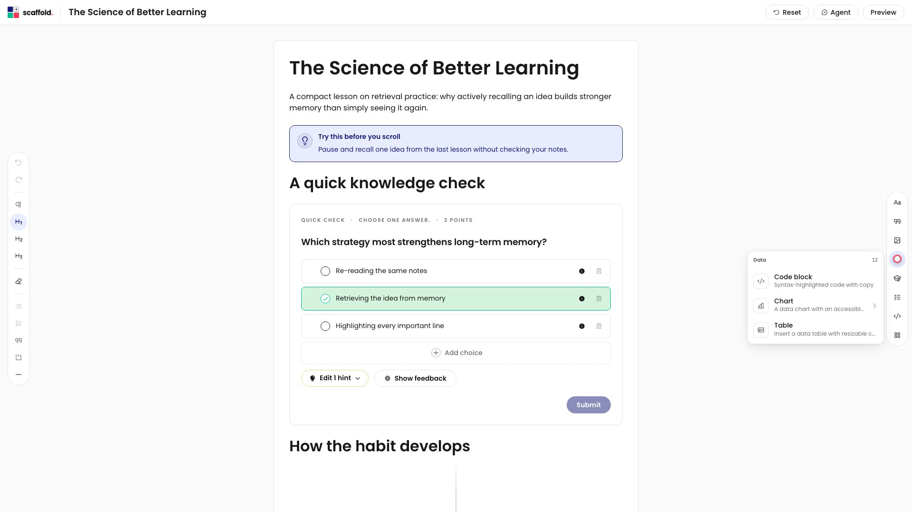
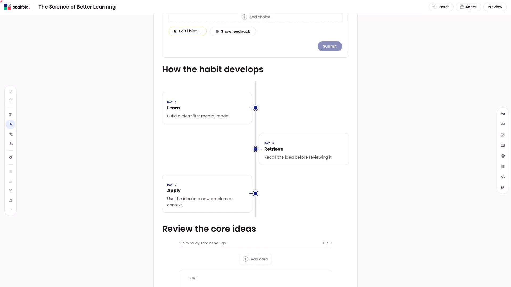
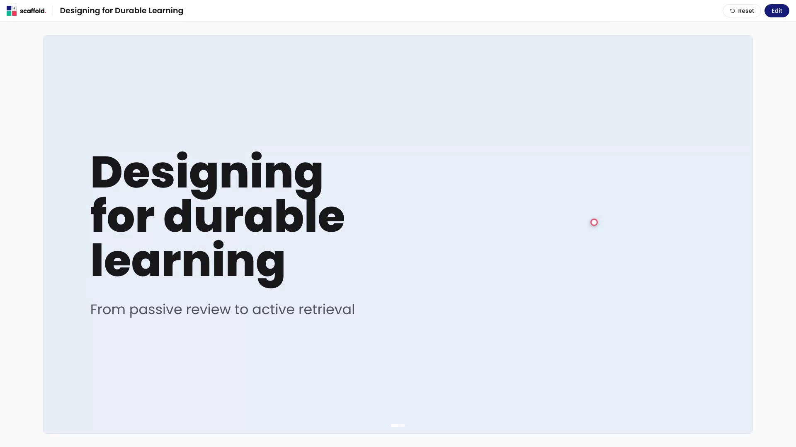

<p align="center">
  
</p>

<p align="center">
  <strong>Open-source course authoring for rich, portable learning experiences.</strong>
</p>

<p align="center">
  <a href="https://github.com/brainjamworks/scaffold/actions/workflows/ci.yml"></a>
  <a href="./LICENSE"></a>
  
</p>



Scaffold is a browser-based authoring toolkit for building course content once
and delivering it through different learning platforms. It combines a
React/Tiptap editor, portable document contracts, learner-safe rendering,
assessment grading, and thin LMS adapters in one open-source workspace.

> [!IMPORTANT]
> Scaffold is pre-alpha. The document format, package APIs, and adapter
> contracts can change before `1.0`. The packages are not published to npm yet;
> clone this repository to evaluate or contribute to the project.

## Why Scaffold

- **One portable course artifact.** Pages and slideshows share the same
  provider-neutral document model.
- **Authoring and delivery are separate.** Authors get editing controls;
  learners receive a runtime projection without answer keys or editor chrome.
- **Rich learning content is built in.** Compose text, media, layouts,
  structured content, interactive presentations, and assessments.
- **Assessment logic is portable.** Serializable contracts and deterministic
  TypeScript grading are kept outside React and host-platform code.
- **Hosts stay in control.** Persistence, media, learner activity, assessment
  delivery, authorization, and platform protocols enter through explicit
  ports.
- **Adapters stay thin.** The same core is integrated through an Open edX
  XBlock and a native Moodle activity module.

## Pages and slides, one document model

Scaffold supports long-form course pages with embedded interactive blocks and
structured layouts.



The same document can contain responsive slide surfaces for presentation-led
learning experiences.



## Included today

| Area                  | What it owns                                                                           |
| --------------------- | -------------------------------------------------------------------------------------- |
| `@scaffold/core`      | React/Tiptap authoring, learner runtime, blocks, layouts, surfaces, and host ports     |
| `@scaffold/contracts` | Provider-neutral persisted document and learner-state schemas                          |
| `@scaffold/grading`   | Framework-free assessment validation and scoring                                       |
| `apps/playground`     | Local IndexedDB-backed browser sandbox                                                 |
| `adapters/xblock`     | Open edX Studio and LMS integration                                                    |
| `adapters/moodle`     | Native Moodle authoring, learner runtime, persistence, grading, and backup integration |

Built-in content includes page and slide surfaces; grids and layouts; images,
audio, charts, embeds, and PDFs; callouts, comparisons, timelines, flashcards,
galleries, glossaries, tables, and checklists; plus multiple-choice,
multi-select, matching, categorisation, sequencing, fill-in-the-blank, dropdown,
image-hotspot, and grouped quiz assessments.

## Quick start

You need Git and a Node.js version accepted by the root `package.json`. Scaffold
uses the [Vite+ toolchain](https://viteplus.dev/guide/).

Install `vp` on macOS or Linux:

```sh
curl -fsSL https://vite.plus | bash
```

Then clone and start the playground:

```sh
git clone https://github.com/brainjamworks/scaffold.git
cd scaffold
vp install
vp run dev:playground
```

Open `http://localhost:5848`. The playground stores one working document in
browser IndexedDB. It is an evaluation and development sandbox, not hosted
storage, authentication, sharing, or a production deployment path.

## Architecture at a glance

```text
@scaffold/contracts <- @scaffold/grading <- apps/playground
@scaffold/contracts <- @scaffold/core    <- apps/playground
                                           <- adapters/*
```

- Contracts owns serializable, provider-neutral data.
- Grading owns deterministic answer-key validation and has no framework
  dependencies.
- Core owns the platform-neutral editor and runtime. It imports Contracts but
  never apps or adapters.
- Apps and adapters compose Core through supported entrypoints and implement
  host services.

See [ARCHITECTURE.md](./ARCHITECTURE.md) for ownership rules, document
boundaries, composition roots, and dependency enforcement.

## Public Core entrypoints

Core exposes role-based package seams rather than one broad root API:

```ts
import { ScaffoldAuthoringEntry } from "@scaffold/core/authoring";
import { ContentRuntimeHost, ScaffoldServicesProvider } from "@scaffold/core/runtime";
import type { ArtifactPersistencePort, MediaPort } from "@scaffold/core/ports";
import "@scaffold/core/styles.css";
```

Additional supported seams are `@scaffold/core/format` and
`@scaffold/core/media-policy`. Do not import from `@scaffold/core/src/...` or
other package source paths.

`@scaffold/core/agent-host` is a narrow, exact-version integration seam for the
separate first-party hosted Agent package. Active Agent behavior and private
activation settings are not included in this repository or installed LMS
adapters.

## Development

Use the smallest focused command while working, then run the release gate
before proposing a merge:

```sh
vp run verify:static        # formatting, Oxlint, and TypeScript
vp run verify:architecture  # dependency-cruiser source boundaries
vp run verify:artifacts     # generated and vendored artifact drift
vp run verify:tooling       # metadata and generator behavior
vp run verify:unit          # package and adapter tests
vp run verify:build         # package and app builds
vp run verify:release       # complete repository gate
```

Dependency-cruiser starts from zero accepted dependency debt. Oxlint,
TypeScript, Vitest, artifact checks, structured metadata tests, and native
adapter tests own the non-dependency evidence.

## Project documentation

- [Architecture](./ARCHITECTURE.md) — package ownership and dependency direction.
- [Contributing](./CONTRIBUTING.md) — setup, boundaries, verification, and pull requests.
- [Open edX adapter](./adapters/xblock/README.md) — XBlock lifecycle and host seams.
- [Moodle adapter](./adapters/moodle/README.md) — plugin build, installation, and backend lifecycle.
- [Support](./SUPPORT.md) — help and issue-reporting guidance.
- [Security](./SECURITY.md) — private vulnerability reporting.

## Contributing

Contributions are welcome while the pre-`1.0` architecture and adapter
contracts settle. Please read [CONTRIBUTING.md](./CONTRIBUTING.md), keep changes
focused, preserve package boundaries, and include the verification evidence
for your change.

## License

Scaffold is licensed under [AGPL-3.0-only](./LICENSE). The separate hosted
product is outside this repository and has its own licensing and deployment
model.
